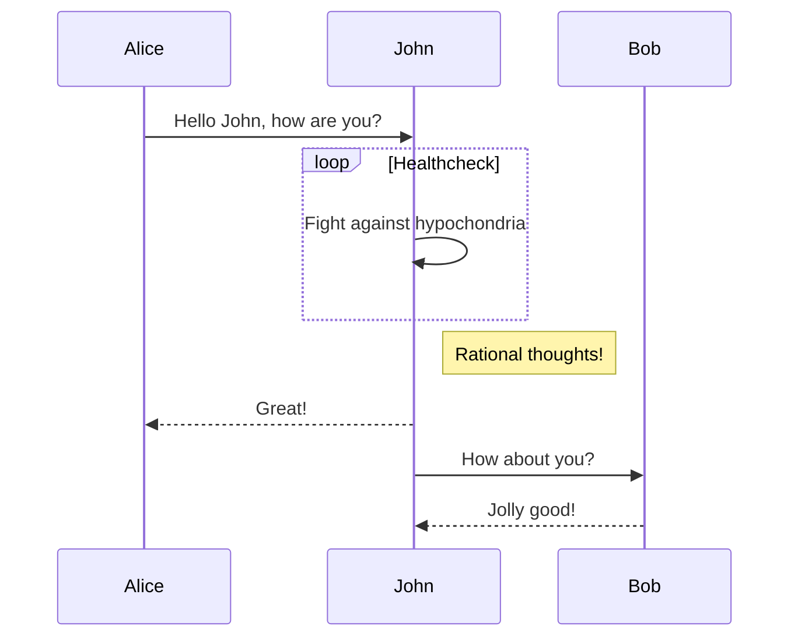

## Markdown Scripting

---

We can use markdown scripting to write great software documentation. Markdown is a simplified markup language used for formatting text.

It Provides a means that converts to HTML and renders to the page. However, markdown is much simpler to use and easier to read.

Markdown files have an extension of .md

### Markdown Language Syntax

The “#” symbol indicates the font size of a text element for example a statement like “# readme” is rendered in HTML as a h1 element tag and “## readme” as a h2 element tag and so on and so forth. Below is an example :

```md

# Sisitech Documentation

```

`Remember to add a space between the “#” and your text to render the section header elements correctly.`

Wrapping a text around ** makes the text bold for example  

```md
**Table of Contents** 
```

while wrapping a text around one * makes the text italic.

```md
*More Information* 
```

Wrapping text around `` backticks formats the text and makes it stand out. For example :

`Markdown scripting is great`

### Working with Code Snippets

Wrap a text around three backticks to paste a code snippet.

```js

  <ion-text>
    <ion-title class="logo-txt">REPUBLIC OF KENYA</ion-title>
    <p class="logo-txt ministry-text">Ministry of Education
      State Department for Early Learning and Basic Education</p>
  </ion-text>

```

Define the language formatting style by declaring the language extension after the three backticks i.e., `py for python`, `js for JavaScript` etc.

Three dashes (---) adds a horizontal line for natural separation. Also note that h1 tags automatically have an underline beneath the text. For example :

---

### Block Quotes

Use “>” to wrap your text in order to create blockquotes. Here a sample with a Steve Jobs quote.

>
“You can’t connect the dots looking forward; you can only connect them looking backwards. So you have to trust that the dots will somehow connect in your future.”

-- *Steve Jobs*
>

### Unordered List

Use a single dash to create an unordered list. For example

- Team 1
- Team 2
- etc

### Hyperlinking Text

Wrap your h1 and h2 tags around square brackets to make it a hyperlink that scrolls to where the header content section is on the page. Add parentheses after the tag followed by the link-URL i.e.

`[General Installation] (#general-installation)`

### Adding Images

To add an image, start the text with an “!” mark. Here is an example:-

```md
      [](image_url)
```

[](https://moekedash.request.africa/)

Most HTML tags such as `<br>` , `<p>` also work with markdown automatically.

[x] and [] are used to display checkboxes (checked and unchecked). For example:-

  ```
  Confirm Terms and Conditions
  [x] No
  [ ] Yes
  ```

### Creating Tables

Use dashes to symbolize the columns and rows of a table. An example would explain this easier.

To define dividers and text alignment in the tables, define this for every row using a colon followed by dashes.

For example - |:------ (left aligned), :------| (right aligned) and |:------| (center aligned)

```md
| Light Color | Current State | Next State |
|:------ | :------ |:------ |
| Green | Yellow | Red |

```

| Light Color | Current State | Next State |
|:------ | :------ |:------ |
| Green | Yellow | Red |

### Creating collapsible content  

Use HTML details and summary tags to create an accordion. For example

```md

<details>
 <summary> Section Header </summary>
    Section Body Text. More information here
</details>

```

<details>
 <summary> Section Header </summary>
    Section Body Text. More information here.
</details>

### Additional Information

Markdown also supports emojis  and formulas.

### Using mermaid

```md
  ``` mermaid
  sequenceDiagram
    Alice->>John: Hello John, how are you?
    loop Healthcheck
        John->>John: Fight against hypochondria
    end
    Note right of John: Rational thoughts!
    John-->>Alice: Great!
    John->>Bob: How about you?
    Bob-->>John: Jolly good!
  ```

```



<hr>
## Checkbox
```
- [x] Lorem ipsum dolor sit amet, consectetur adipiscing elit
- [ ] Vestibulum convallis sit amet nisi a tincidunt
    *[x] In hac habitasse platea dictumst
    * [x] In scelerisque nibh non dolor mollis congue sed et metus
    * [ ] Praesent sed risus massa
- [ ] Aenean pretium efficitur erat, donec pharetra, ligula non scelerisque

```

- [x] Lorem ipsum dolor sit amet, consectetur adipiscing elit
- [ ] Vestibulum convallis sit amet nisi a tincidunt
    * [x] In hac habitasse platea dictumst
    * [x] In scelerisque nibh non dolor mollis congue sed et metus
    * [ ] Praesent sed risus massa
- [ ] Aenean pretium efficitur erat, donec pharetra, ligula non scelerisque


## Warning, Notes

!!! caution
    It must be the absolute path not a relative path


!!! note
    It must be the absolute path not a relative path


### Research Links

1. [Latex](https://www.latex-project.org/)
1. [Mermaid ](https://mermaid-js.github.io/mermaid/#/)
1. [Python RST](https://en.wikipedia.org/wiki/ReStructuredText)
1. [MediaWiki](https://www.mediawiki.org/wiki/MediaWiki)
