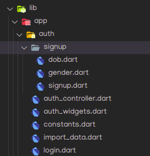
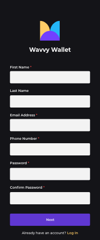
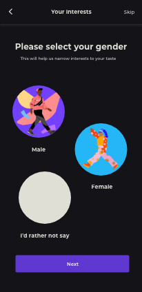
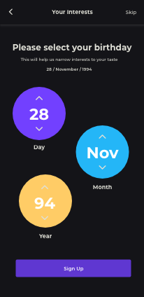
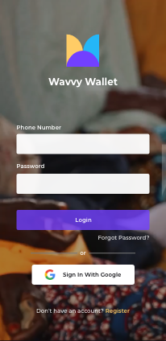

# Authentication

- This document highlights the implementation process of authentication in Wavvy Wallet.

## Authentication Documentation Table of Contents
1. [Auth Overview](./auth_overview.md)
2. [Auth UI Custom Widgets](./auth_ui.md)
3. [Auth Logic](./auh_logic.md)
4. [Auth API](auth.api.md)

  
<table>
    <tr><th>File/Folder Name</th><th>Description</th> </tr>
    <tr><td>📁 signup</td><td>Contains all the pages in he sign up user flow i.e. Sign Up ⮕ Gender Page ⮕ Date of birth Page</td></tr>
    <tr><td>📄 auth_controller.dart</td><td>This file is used across all import pages or any file that uses authentication logic. Contains all the authentication logic i.e sign in and sign up functions used in the auth pages. Also contains setter and getter functions for user profiles as well as other auth related code e.g. Forgot Password logic.</td></tr>
    <tr><td>📄 auth_widgets.dart</td><td>Contains custom widgets in the auth pages. i.e formField, passwordField and textSpan.</td></tr>
    <tr><td>📄 constants.dart</td><td>This file contains url (auth api endpoints) used in auth_controller </td></tr>
    <tr><td>📄 import.dart</td><td>Contains code that shows user prompts for allwoing importing of messages as well as selection of date range for message import.</td></tr>
    <tr><td>📄 login.dart</td><td>Contains the user interface code for the log in page</td></tr>
</table>

    

        
        
        
        
    

!!! note
Directory with all the auth code : *[lib/app/auth][1]*

[1]: https://github.com/sisitech/expense_tracker/blob/789e8b87a141433b1c9f189d8b7a0b384be174ac/lib/app/auth/

