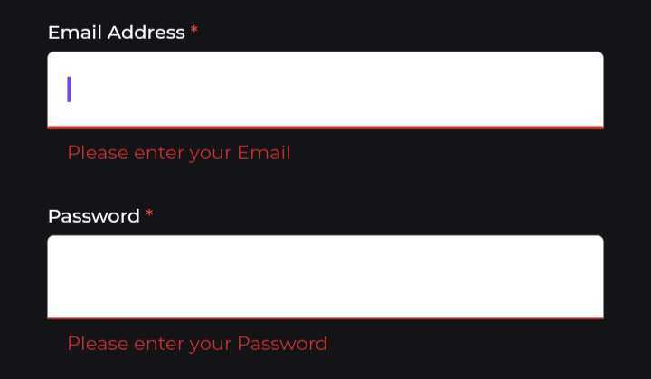

# Auth UI Custom Widgets

- There are 3 custom widgets being used throughout the auth pages i.e :
  1. formField
  2. passwordField
  3. textSpan

!!! note
To globally change any property of the form fields (i.e. size, color, widget types e.t.c) in the auth pages, one can make edits to the individual widgets in the auth_widgets.dart file and the changes will be made globally. The directory : *[lib/app/auth/auth_widgets.dart][1]*

   
## formField Widget


### Usage
```dart title="in the desired auth page" linenums="1"
    formField(
        label: 'Email Address',
        controller: emailctrl,
        type: TextInputType.emailAddress,
        validator: (value) {
        if (value == null || value.isEmpty) {
            return 'Please enter your Email';
        }
        return null;
        },
    ),
```
### Properties
1. **label**
<table>
 <tr><td>Description</td><td>The form feild title</td></tr>
 <tr><td>Type</td><td>String</td></tr>
 <tr><td>Required</td><td>true</td></tr>
</table>

2. **controller**
<table>
 <tr><td>Description</td><td>The TextEditing Controller for the form field. Must be declared and initialised first before passing to formField widget. Would be advisable to also dispose it when the page is permanently removed from the tree.</td></tr>
 <tr><td>Type</td><td>TextEditingController</td></tr>
 <tr><td>Required</td><td>true</td></tr>
</table>

3. **type**
<table>
 <tr><td>Description</td><td>Determines the type of keyboard that will be showed for the form field</td></tr>
 <tr><td>Type</td><td>TextInputType?</td></tr>
 <tr><td>Required</td><td>false</td></tr>
 <tr><td>Default</td><td>TextInputType.text</td></tr>
</table>

4. **validator**



<table>
 <tr><td>Description</td><td>Function that validates the input of the form field</td></tr>
 <tr><td>Type</td><td>String? Function(String?)</td></tr>
 <tr><td>Required</td><td>true</td></tr>
</table>

## passwordField Widget


### Usage
```dart title="in the desired auth page" linenums="1"
    passwordField(
        isHidden: _isHidden,
        validator: (value) {
        if (value == null || value.isEmpty) {
            return 'Please enter your Password';
        }
        return null;
        },
        controller: passctrl,
        label: 'Password',
    ),
```
### Properties
The passwordField widget extends most of the formField Widget properties with the exception of **type** property. It has only one additional widget which is the main difference between the two widgets :

**isHidden**
<table>
 <tr><td>Description</td><td>A boolean property that handles toggling between obscure text and visble text. The property must be decalred and initialised before passing it to passwordField.</td></tr>
 <tr><td>Type</td><td>RxBool</td></tr>
 <tr><td>Required</td><td>true</td></tr>
</table>


<style>
    .image{
        height: 200px;
    }
</style>

[1]: https://github.com/sisitech/expense_tracker/blob/789e8b87a141433b1c9f189d8b7a0b384be174ac/lib/app/auth/auth_widgets.dart