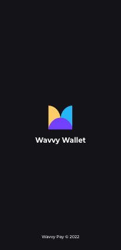

# Splash Screen

This document highlights the implementation process of the Wavvy Wallet App Splash Screen. The method varies for android and iOS phones as follows :

[]

!!! note
    Directory with all the splash screen code : *[android/app/src/main/res/drawable/launch_background.xml](https://github.com/sisitech/expense_tracker/blob/15e310a5adb8cb69dd6c530ddb8986b9a5855697/android/app/src/main/res/drawable/launch_background.xml)*
    
## Android

1. Generating the different mimmap assets for the ic_launcher. Using the [Wavvy Wallet Logo](../images/walletlogo.png) and an [Android Asset Generator][1]
2. IntegratiAfter placing the different images in their folders, the next step is integrating it with code :

```xml hl_lines="4 7 8" title="launch_background.xml" linenums="1"
<?xml version="1.0" encoding="utf-8"?>
<!-- Modify this file to customize your launch splash screen -->
<layer-list xmlns:android="http://schemas.android.com/apk/res/android">
    <item android:drawable="@android:color/black" />

    <!-- You can insert your own image assets here -->
    <item>
        <bitmap
            android:gravity="center"
            android:src="@drawable/launch_image" />
    </item>
</layer-list>

```
## iOS

- Yet to be implemented in iOS.

## Take Aways
- Adding texts to splash screens is curretly unadvised/ not supported on android. The task would be to figure out a workaround so as to achive the initial design.
  
## References
1. [Splash Screen Implementation Commit](https://github.com/sisitech/expense_tracker/commit/15e310a5adb8cb69dd6c530ddb8986b9a5855697)
2. [Video Reference](https://www.youtube.com/watch?v=JVpFNfnuOZM&t=173s)
3. [Android Asset Generator][1]

[1]: https://romannurik.github.io/AndroidAssetStudio/icons-launcher.html#foreground.type=clipart&foreground.clipart=android&foreground.space.trim=1&foreground.space.pad=0.25&foreColor=rgba(96%2C%20125%2C%20139%2C%200)&backColor=rgb(68%2C%20138%2C%20255)&crop=0&backgroundShape=circle&effects=none&name=ic_launcher