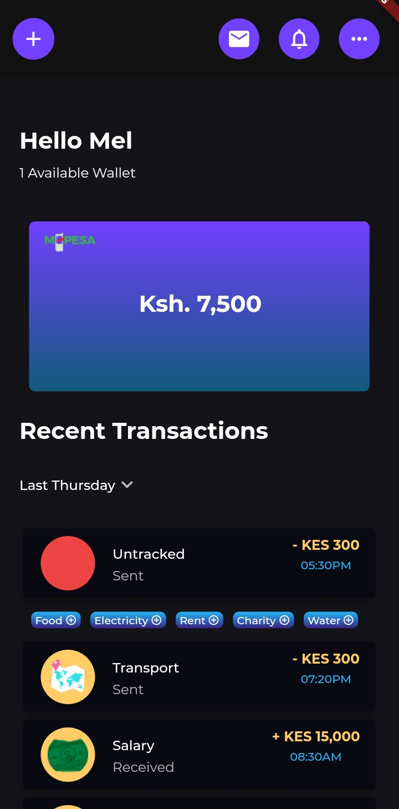
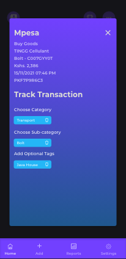
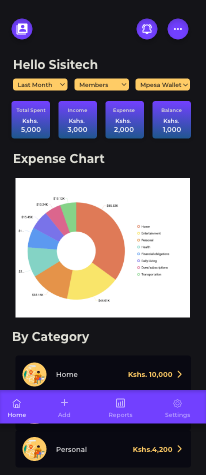
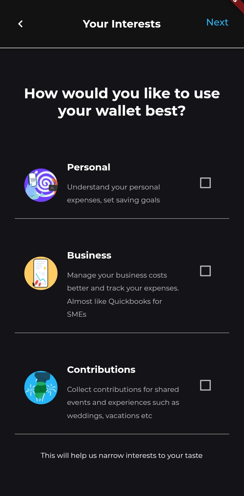

# Wavvy Wallet

Wavvy Wallet is a FinTech Project aimed at tracking your daily expenses automatically. It is based on Flutter Framework.

  

    
    
    
    
  

## Table of Contents

1. [Designs](./Design/)
2. [Implementation](./Implementation/)
   1. [Splash Screen](./Implementation/splash.md)
   2. [Onboarding Screebs](./Implementation/onboarding.md)
   3. [Authentication](./Implementation/auth.md)
3. [API & Database](./API/)
4. [Research]()

